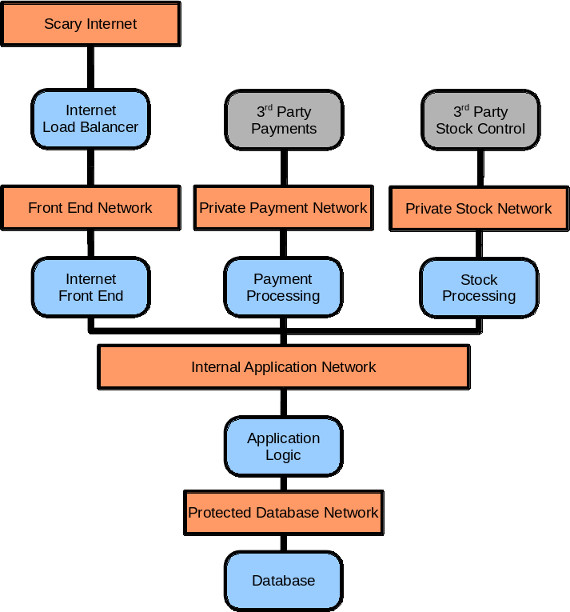
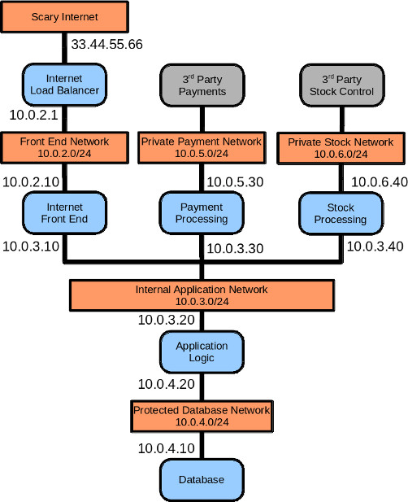
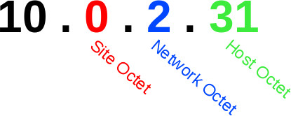

[Preface]: #preface
[A Scenario]:#a-scenario
[The Company Expands]:#the-company-expands
[Ever Expanding]:#ever-expanding
[An Architecture Change]:#an-architecture-change
[Getting Out Of Hand]:#getting-out-of-hand
[Scenario Over, Now The Module]:#scenario-over-now-the-module
[The Problem This Module Solves]:#the-problem-this-module-solves

[Solving The Scenario's Problems]:#solving-the-scenarios-problems
[Deduplication]:#deduplication
[Abstraction]:#abstraction
[Modelling Architecture]:#modeling-architecture
[Changing the Physical Implementation]:#changing-the-physical-implementation
[Shared Infrastructure and VLAN tags]:#shared-infrastructure-and-vlan-tags

[Networking]:#networking
[Limitations]:#limitations
[features]:#features
[Quick Start]:#quick-start
[Quick Start with Hiera]:#quick-start-with-hiera
[Quick Start with Logical Networking and Defined Types]:#quick-start-with-logical-networking-and-defined-types

[Reference]:#reference
[Facts]:#facts
[Public Classes]:#public-classes
[Public Defines]:#public-defines
[Providers]:#providers

#### Table of Contents

1.  [Preface][Preface]
1.  [A Scenario][A Scenario]
    1.  [The Company Expands][The Company Expands]
    1.  [Ever Expanding][Ever Expanding]
    1.  [An Architecture Change][An Architecture Change]
    1.  [Getting Out Of Hand][Getting Out Of Hand]
    1.  [The Problem This Module Solves][The Problem This Module Solves]
1.  [Solving The Scenario's Problems][Solving The Scenario's Problems]
    1.  [Deduplication][Deduplication]
    1.  [Abstraction][Abstraction]
    1.  [Modelling Architecture][Modelling Architecture]
    1.  [Changing the Physical Implementation][Changing the Physical Implementation]
    1.  [Shared Infrastructure and VLAN tags][Shared Infrastructure and VLAN tags]
    1.  [Scenario Over, Now The Module][Scenario Over, Now The Module]

---

1.  [Networking][Networking]
    1.  [Limitations][Limitations]
    1.  [Features][Features]
    1.  [Quick Start][Quick Start]
        1.  [Quick Start with Hiera][Quick Start with Hiera]
        1.  [Quick Start with Logical Networking and Defined Types][Quick Start with Logical Networking and Defined Types]
    1.  [Reference][Reference]
      1.  [Facts][Facts]
      1.  [Public Classes][Public Classes]
      1.  [Public Defines][Public Defines]
      1.  [Providers][Providers]

# Preface

This is not a "real" Puppet module - it's not designed to be cloned or put on the Forge. It even refers to other Puppet
modules that are not publicly available. In fact, if you <i>did</i> blindly install this module into your infrastructure,
I guarantee it will break your servers, eat your homework, and kill your cat.

This module is a fork of LMAX's internal networking module with a lot of internal information stripped out of it.
The idea behind releasing this is to demonstrate a method of abstracting networking concepts from networking specifics.
It is designed to educate new LMAX staff, plus a few people on the Puppet Users list who expressed some interest.
The discussion in Puppet Users thread [How to handle predictable network interface names](https://groups.google.com/d/msg/puppet-users/67qJWyF-40w/VZE5KaOlBAAJ)
is what motivated me to fork our internal module to describe it to other people.

I'm now going to fabricate a scenario that will explain the goals we are trying to reach by doing networking this way in Puppet.
The scenario is very loosely modelled on our own Financial systems architecture but more closely matches the culture of
of the Infrastructure team, which is how our networking
evolved into what it is now. If the scenario sounds completely alien to you - for example if you run a Cloud web farm
where every instance is a transient short-lived VM - then the design pattern this module is promoting probably won't be that
helpful to you.

# A Scenario

Imagine a company that runs some sort of medium sized Web e-Commerce business. The IT team there maintain very tight control of
their infrastructure and their system design is described below.

As you'd expect there is a Web UI, and a load balancer in front of that. The buying and selling logic is handled by an Application server,
and a database is used for persistent storage. The actual credit card processing is outsourced to a third party API. Delivering of
physical goods and stock control is also handled by a 3rd party company.

The load balancer is connected to the Internet. An internal network connects load balancer to web severs. a separate internal network
allows all the internal applications to communicate with each other: web, logic, payments and stock. For security reasons, only the
application logic server is allowed to comminucate with the database and it has a physically separate network to do this. The payments
processing server talks to the 3rd party API over a private link, not over the Internet. Same with the stock control system - it's a private
connection to the warehouse. There's also other networks, like for management, but they aren't important here.

If you were to draw this system design it would look like this. Orange rectangles are networks implemented by switches or routers,
blue blocks are servers that the company manages with Puppet, and grey boxes are 3rd party APIs that the company's software talks to:



When the tech team built their production site they were pretty regimental and organised about the whole thing. The VLAN tags on the switches
matched part of the IP address so the engineers always knew which VLAN is supposed to be each network and vice versa (eg: 10.0.2.x is VLAN 2).

| VLAN | Network | IP Range |
|----------|---------|----------|
| 2 | Web | 10.0.2.0/24 |
| 3 | Application | 10.0.3.0/24 |
| 4 | Database | 10.0.4.0/24 |
| 5 | Payments | 10.0.5.0/24 |
| 6 | Stock | 10.0.6.0/24 |

Now if we add example IPs to the diagram:



Managing the networking of the machines above is pretty straight forward. Using this networking module they have done it in Hiera. Here
are two example Hiera data files for some machines (some of the YAML has been truncated for brevity).

The Internet Front End / Web server:

```yaml
networking::interfaces:
  eth0:
    type: Ethernet
    ipaddr: 10.0.2.10
    gateway: 10.0.2.1
    netmask: 255.255.255.0
  eth1:
    type: Ethernet
    ipaddr: 10.0.3.10
    netmask: 255.255.255.0
```

The application logic server:

```yaml
networking::interfaces:
  eth0:
    type: Ethernet
    ipaddr: 10.0.3.10
    gateway: 10.0.3.1
    netmask: 255.255.255.0
  eth1:
    type: Ethernet
    ipaddr: 10.0.4.10
    netmask: 255.255.255.0
```

There are 5 servers, so there are 5 per-node Hiera YAML files.
Each file has about 10-15 lines of networking information. What gets written to disk on the actual
servers is your standard networking config that anyone who knows Red Hat should recognise:

```
[root@host ~]# cat /etc/sysconfig/network-scripts/ifcfg-eth0
ONBOOT=yes
USERCTL=no
DEVICE=eth0
TYPE=Ethernet
BOOTPROTO=none
IPADDR=10.0.3.10
GATEWAY=10.0.3.1
NETMASK=255.255.255.0
```

All pretty simple and manageable so far.

### The Company Expands

The business does well and so they decide to open another site on another continent.
The application architecture remains pretty much the same, so the tech team are just
copying what they've done already to build the next set of infrastructure.  It is a 
logically separate application but still inside the same company intranet, so the IP addressing
must be unique. The engineers like to keep things consistent, so they come up with a nice standard where
the same vlan tags are used to deliver the same logical
networks as the first site (ie: vlan 3 in the US and in the EU is the Application network).

The only thing that changes is the IP ranges:

| Site | VLAN | Network | IP Range |
|------|----------|---------|----------|
| EU | 2 | Web | 10.0.2.0/24 |
| EU | 3 | Application | 10.0.3.0/24 |
| EU | 4 | Database | 10.0.4.0/24 |
| EU | 5 | Payments | 10.0.5.0/24 |
| EU | 6 | Stock | 10.0.6.0/24 |
| US | 2 | Web | 10.1.2.0/24 |
| US | 3 | Application | 10.1.3.0/24 |
| US | 4 | Database | 10.1.4.0/24 |
| US | 5 | Payments | 10.1.5.0/24 |
| US | 6 | Stock | 10.1.6.0/24 |

10.0.0.0/16 is the Europe application, and 10.1.0.0/16 is the US application. The Engineering team have created standards
where the third octet always describes the type of Network, ie: 3 is the Application network no matter what Site it is in.
This sort of consistency helps the engineers' mindset and to recognise patterns, eg: an IP address of 10.1.2.5 is instantly
recognised as a Web IP, the engineers expect that this IP will be doing something with HTTP traffic.
It also makes the engineers feel warm and fuzzy, which is a good thing. An IP address can
be broken down into it's component parts like so:




Five new servers are purchased, the Hiera files from the first servers are copied and someone
does a Sed search and replace to change the IP addresses. There are now 10 per-node YAML
files with 10-15 lines each, so about 100 lines of Hiera config. Job done, still manageable.

### Ever Expanding

Five servers for each site is not cutting it any more, the company is doing a lot of traffic. The
web front end capacity is drastically increased, along with redundant application servers and
databases.

There are now over a dozen web servers at each site and a half dozen other machines. There's
also been a focus on redundancy, so before where the engineers used single interfaces for connections
to networks they are now using bonded interfaces. This is what one of the Web server Hiera files
looks like now:

```yaml
networking::interfaces:
  bond2:
    type: Bonding
    ipaddr: 10.0.2.10
    gateway: 10.0.2.1
    netmask: 255.255.255.0
  eth0:
    type: Ethernet
    slave: yes
    master: bond2
  eth2:
    type: Ethernet
    slave: yes
    master: bond2
  bond3:
    type: Bonding
    ipaddr: 10.0.3.10
    gateway: 10.0.3.1
    netmask: 255.255.255.0
  eth1:
    type: Ethernet
    slave: yes
    master: bond3
  eth3:
    type: Ethernet
    slave: yes
    master: bond3
```

It took the engineers a some time to add the Bonding configuration to every machine. A few mistakes
were made but corrected. The Hiera data is starting to be difficult to manage.

We're now at about (18 x 26 x 2) 1000 lines of networking information in Hiera. 

### An Architecture Change

The application design needs to be extended - the web servers are now doing credit card fraud checks before
the processing reaches the application logic or payment servers. This means the web servers need to be able to
communicate with the payment API, which means they all need to be connected to the payments network (VLAN 5).

This is what a web server's Hiera YAML contains now:

```yaml
networking::interfaces:
  bond2:
    type: Bonding
    ipaddr: 10.0.2.10
    gateway: 10.0.2.1
    netmask: 255.255.255.0
  eth0:
    type: Ethernet
    slave: yes
    master: bond2
  eth2:
    type: Ethernet
    slave: yes
    master: bond2
  bond3:
    type: Bonding
    ipaddr: 10.0.3.10
    gateway: 10.0.3.1
    netmask: 255.255.255.0
  eth1:
    type: Ethernet
    slave: yes
    master: bond3
  eth3:
    type: Ethernet
    slave: yes
    master: bond3
  bond5:
    type: Bonding
    ipaddr: 10.0.5.10
    gateway: 10.0.5.1
    netmask: 255.255.255.0
  eth4:
    type: Ethernet
    slave: yes
    master: bond5
  eth5:
    type: Ethernet
    slave: yes
    master: bond5
```

There were over 2 dozen web servers that had to have the bond5 interface added. Unfortunately due to the sheer number
of file edits the engineers had to make some mistakes happened, a web server got missed and that server was unable to do
credit card checks when the code was released to production.

Bosses were unhappy. Several kittens were killed. It was bad for publicity.

### Getting Out Of Hand

The engineering team now has to build a hardware-equivalent replica (but with reduced capacity) so the development
team can do performance benchmarks against it. The company also needs several other Dev and Staging instances
of the application, but need it cheapely so it has to be solved with VMs and shared networking switches. The
number of Puppet nodes will increase by another 20-30 at least.  Also because there are no
payment or stock APIs to talk to in these test environments, they are all stubbed to one development server
(ie: the Payment and Stock network are the same for all of Perf, Dev and Staging).

This is achievable with the same Puppet/Hiera approach, but the standards the engineering team set at the start are
breaking - shared switches between environments means the VLAN tags have to be different and
they no longer represent the logical network they that are delivering. The warm fuzzy feeling is fading.

Finally, the unhappy bosses have also come back with a mandate - architecture changes must be consistent across all
environments, we can't have a repeat of the credit card check problem.

With that, the way the engineering team is approaching network config needs to be completely overhauled.

### The Problem This Module Solves

What started as a very flexible way of defining networking in Hiera eventually ballooned into a large amount
of configuration that was hard for the engineering team to handle. The approach, while flexible, wasn't helpful
in keeping things "the same". Architecture changes required too many edits. Expanding capacity required too many copy
and pastes. There is too much "necessary data" that needs to be added to a node's Hiera file.

It's also <i>impossible</i> to enforce any sort of architecture consistency when each node individually describes the
sum of it's entire networking configuration.

That's the rather large intro done. The rest of this page is the documentation for the module itself, demonstrating
how you can use it solve different problems from the scenario above.

## Solving The Scenario's Problems

The scenario in the [Preface](#preface) describes a number of problems that have evolved naturally from an Engineering Team's
design choices. In this section I talk about each of those problems and how this networking module helps to alleviate them.

### Deduplication

There is a great deal of "boiler plate" networking config
present for every server. With some smart use of class parameters and Hiera the engineering team
are able to deduplicate a lot the networking config in Hiera and model the concept of their logical networks.

The logical networks all have a common third octet (eg: "Application" is always 10.x.3.x).
Different instances of the application are separated by IP range, eg: EU is 10.0.0.0/16 and US is 10.1.0.0/16. By
looking at any IP address we can tell what site and what logical network it is part of.
10.0.4.20 will be EU Database network, 10.1.6.10 will be US Stock network.

We can also do the reverse. I should be able to figure out what IP address a server has in the
"EU Application network" as long as I know the site the server is located in, and the fourth octet of the IP address.

Lets consider one server's Application network. Currently the Hiera would look like this:

```yaml
networking::interfaces:
  bond3:
    type: Bonding
    ipaddr: 10.0.3.10
    gateway: 10.0.3.1
  eth1:
    type: Ethernet
    slave: yes
    master: bond3
  eth3:
    type: Ethernet
    slave: yes
    master: bond3
```

Where each key in the `networking::interfaces` hash gets extrapolated as a `networking::config::interface` defined type
(using the magic [create_resources](https://docs.puppet.com/puppet/latest/reference/function.html#createresources) function).

We can convert this to Puppet code below to remove a lot of the redundant information. We're going to invent a class - it doesn't
matter what the class is called as this is just an example, but in the real world it would probably be one of your Profiles:

```puppet
node 'some_node' {
  include ::profile::application_network
}

class profile::application_network($host_octet, $slaves) {
  include ::networking
  networking::simple_bond { $::networking::_subnet_application_bond:
    ipaddr  => "${::networking::subnet_application}.${host_octet}"
    slaves  => $slaves,
  }
}
```

**NOTE:** Ignore the `$::networking` parameters for now, I'll get into that in the [Abstraction](#abstraction) section.

We only need to supply two pieces of information to the `networking::simple_bond` Defined Type; the bonding slaves and the fourth octet
of the IP address.  We will rely on Puppet's Automatic Parameter Lookup feature to get this data from Hiera. The node's Hiera will contain
these keys to pass parameters to `profile::application_network`:

```yaml
profile::application_network::host_octet: 10
profile::application_network::slaves: [ 'eth1', 'eth3', ]
```

Where before we had 13 lines of Hiera to describe this machine's network, we now have 2. The configuration that gets written to the server
remains the same, but we've reduced the amount of Hiera data our Puppet/Hiera uses to generate this config.
The `profile::application_network` Puppet Class is also re-usable on any node that is connected to the Application Network.
If we applied that to the company's entire estate of around 70 servers, we'd reduce 900 lines of Hiera to around 100 or so.
This is a good deduplication win.

### Abstraction

The technical team established very early on the concept of an "Application" network, and a "Payments" network, etc, but
this was not represented in Hiera. What's in Hiera is the physical network - IP addresses, interfaces, and bonds. The logical
representation existed only in the brains of the engineers.

The `profile::application_network` class above also gives us abstraction. When using this class neither the Node definition nor
the node's Hiera file contain
anything to do with the subnet or network layout. These details are abstracted away into the `networking` class, and referred to
by "logical" name.

The `networking` class is what has the concept of "Application" network. You'll remember that the Engineering Team were 
very pragmatic when they did their network design so the `networking` module is able to make some assumptions that fit
most cases. The `networking` class
exposes a number of parameters that are used to map logical network names to physical things. The relevant parameters and variables
for the "Application" network end up being this by default:

```puppet
$::networking::subnet_site = '192.168'
$::networking::vlan_application = '3'
$::networking::_subnet_application = '192.168.0.3'
$::networking::_subnet_application_bond = 'bond3'
```

A 192.168 IP address doesn't help us though, the team uses 10.x.0.0/16. We need to override `networking::subnet_site`, and this
is where a smart Hiera hierarchy comes in. Lets assume a simple three level hierarchy:

1. Node
1. Site
1. Global

You may remember that each "Site" is an instance of the company's application (EU, US, etc), and the engineering team designed each site as a
unique 10.x.0.0/16 network block.  It becomes simple to override the Site subnet in Hiera now.

The `site/eu.yaml` file would contain:

```yaml
---
networking::subnet_site: '10.0'
```

The `site/us.yaml` file would contain:

```yaml
---
networking::subnet_site: '10.1'
```

We can now use the same `profile::application_network` class on EU and US node definitions and it will create
correct IP addresses on both servers without the node having to specify anything more than it's host octet:

```puppet
node 'eu_app_server' {
  include ::profile::application_network  # will create a 10.0.3.x interface
}

node 'us_app_server' {
  include ::profile::application_network  # will create a 10.1.3.x interface
}
```

### Modelling Architecture

One of the problems the engineering team had was when they were asked to put all Web servers
on the payments network. This large architecture change required a lot of Hiera changes and some mistakes were made.
Following that there was the requirement from
management that all future architecture changes are consistent. The current per-node Hiera description of networking cannot satisfy
this requirement.

The modelling of networking architecture is more a feature of the Role / Profile design pattern and smart use of
Puppet code, rather than a feature of this `networking` module itself. This `networking` module is designed to compliment
the Role / Profile design pattern (especially through abstraction) so here's a demonstration.

This Puppet class would build the networking for a [Scenario](#scenario) Web Server:

```puppet
class ::profile::web_server(
  $host_octet,
  $web_network_slaves,
  $application_network_slaves,
) {
  include ::networking
  networking::simple_bond { $::networking::_subnet_web_bond:
    ipaddr  => "${::networking::web_application}.${host_octet}"
    slaves  => $web_network_slaves,
  }
  networking::simple_bond { $::networking::_subnet_application_bond:
    ipaddr  => "${::networking::subnet_application}.${host_octet}"
    slaves  => $application_network_slaves,
  }
}
```

As long as every node that was a Web Server actually had `include ::profile::web_server` or equivalent then the above
networking layout will be enforced on the machine. Adding a new network to every Web Server now becomes trivial. The only
code you need to add to this class is:

```puppet
  networking::simple_bond { $::networking::_subnet_payments_bond:
    ipaddr  => "${::networking::subnet_payments}.${host_octet}"
    slaves  => $payments_network_slaves,
  }
```

A new parameter `profile::web_server::payments_network_slaves` will need to be added to every node's Hiera which contains
the interface names that form the payments network on that node.

With the above design pattern you get network architecture modelled in Puppet and make it easy to enforce architecture
changes estate wide.

### Changing the Physical Implementation

The simplicity of the Puppet code above relies on the engineering team being able to enforce their design, rules like:

1. The Application network is always VLAN 3 and always 10.x.3.0/24
1. The bonding interface on the Application network is "bond3", named after the VLAN tag

With the introduction of the Performance, Dev and Staging environments the engineering team need to make
the Payments and Stock networks in Perf, Dev and Staging the <i>same physical network</i> (because those external APIs are
being stubbed internally).
The physical layout will need to change, but the logical design doesn't need to change. After all,
Web Servers are still connected to the payments network.  Here is how you would do this.

Sticking with the same [Scenario](#scenario) Web Server Profile above:

```puppet
class ::profile::web_server(
  $host_octet,
  $web_network_slaves,
  $application_network_slaves,
  $payments_network_slaves,
) {
  include ::networking
  networking::simple_bond { $::networking::_subnet_web_bond:
    ipaddr  => "${::networking::web_application}.${host_octet}"
    slaves  => $web_network_slaves,
  }
  networking::simple_bond { $::networking::_subnet_application_bond:
    ipaddr  => "${::networking::subnet_application}.${host_octet}"
    slaves  => $application_network_slaves,
  }
  networking::simple_bond { $::networking::_subnet_payments_bond:
    ipaddr  => "${::networking::subnet_payments}.${host_octet}"
    slaves  => $payments_network_slaves,
  }
}
```

We can set Performance, Dev and Staging up as separate "Sites":

```yaml
---
#Performance Site
networking::subnet_site: '10.10'
```
```yaml
---
#Development Site
networking::subnet_site: '10.11'
```
```yaml
---
#Staging Site
networking::subnet_site: '10.12'
```

This will by default create payments network IPs in the 10.10.5.0/24, 10.11.5.0/24 and 10.12.5.0/24 ranges by default, but
we need them as the same IP range. We can override the Payments subnet in Hiera to specify common IP range:

```yaml
---
#Performance Site
networking::subnet_site: '10.10'
networking::subnet_payments: '192.168.45'
```
```yaml
---
#Development Site
networking::subnet_site: '10.11'
networking::subnet_payments: '192.168.45'
```
```yaml
---
#Staging Site
networking::subnet_site: '10.12'
networking::subnet_payments: '192.168.45'
```

No changes need to be made to `profile::web_server` - the logical design remains the same.

### Shared Infrastructure and VLAN tags

The Perf, Dev and Staging environments had to be built cheaply. While the real environments had physically separate network
interfaces for the different networks, the dev environments may have only one or two interfaces with the different networks
tagged on top of that. The engineering team will have to abandon their VLAN standard, but should be able to preserve
their IP address standard, ie: the Application Network is always 10.x.3.x.  In order to do this we will have to modify our
Profile because how the network is physically implemented needs to change:

```puppet
class ::profile::web_server(
  $host_octet,
  $web_network_slaves,
  $application_network_slaves,
  $payments_network_slaves,
  $vlan_tagged = false,
  $vlan_tagged_bond = 'bond0',
) {
  include ::networking

  $web_ip         = "${::networking::web_application}.${host_octet}"
  $application_ip = "${::networking::subnet_application}.${host_octet}"
  $payments_ip    = "${::networking::subnet_payments}.${host_octet}"

  if (str2bool($vlan_tagged)) {
    networking::simple_bond { $vlan_tagged_bond:
      slaves => $web_network_slaves,
    }
    networking::vlan { "${vlan_tagged_bond}.${::networking::vlan_web}":
      ipaddr => $web_ip,
    }
    networking::vlan { "${vlan_tagged_bond}.${::networking::vlan_application}":
      ipaddr => $application_ip,
    }
    networking::vlan { "${vlan_tagged_bond}.${::networking::vlan_payments}":
      ipaddr => $payments_ip,
    }
  } else {
    networking::simple_bond { $::networking::_subnet_web_bond:
      ipaddr  => $web_ip,
      slaves  => $web_network_slaves,
    }
    networking::simple_bond { $::networking::_subnet_application_bond:
      ipaddr  => $application_ip,
      slaves  => $application_network_slaves,
    }
    networking::simple_bond { $::networking::_subnet_payments_bond:
      ipaddr  => $payments_ip,
      slaves  => $payments_network_slaves,
    }
  }
}
```

We've introduced a boolean to switch between either creating three Bonded interfaces (our production servers) or 
one Bonded interface with three VLAN tags on top (our dev servers). The fact that we've had to resort to a boolean switch
here could be an indication of poor design. It depends on your point of view and where you want to implement 
the physical network differences. With some refactoring these details could be further abstracted away somewhere else.
Maybe all you want to see is `application_network` and whether it's a VLAN interface or a Bond is handled elsewhere. Where
you do this is up to you.

There is some Hiera overrides to accompany the class. We need to store the VLAN tag values as they appear on the switches
(that's how VLANs in Linux work) however we want to preserve the same IP address standard, so we also need to
set `networking::subnet_web` and `networking::subnet_application` back to the 10.x.2.x and 10.x.3.x standard respectively:

```yaml
---
#Performance Site
networking::subnet_site: '10.10'
networking::vlan_web: 137
networking::vlan_application: 138
networking::vlan_payments: 139
networking::subnet_web: '10.11.2'
networking::subnet_application: '10.11.3'
networking::subnet_payments: '192.168.45'
profile::web_server::vlan_tagged: true
```
```yaml
---
#Development Site
networking::subnet_site: '10.11'
networking::subnet_payments: '192.168.45'
networking::vlan_web: 216
networking::vlan_application: 218
networking::vlan_payments: 139
networking::subnet_web: '10.10.2'
networking::subnet_application: '10.11.3'
networking::subnet_payments: '10.11.5'
profile::web_server::vlan_tagged: true
```
```yaml
---
#Staging Site
networking::subnet_site: '10.12'
networking::vlan_web: 1001
networking::vlan_application: 1003
networking::vlan_payments: 139
networking::subnet_web: '10.12.2'
networking::subnet_application: '10.12.3'
networking::subnet_payments: '192.168.45'
profile::web_server::vlan_tagged: true
```

With the code and data above, we can create a Web Server in the EU Production network and it will get a 10.0.2.x Web IP
on a dedicated bonded interface, and using the exact same profile in Performance it will get a 10.10.2.x Web IP vlan tagged
on a shared bonded interface. The physical implementation is 
handled by the web server profile, and controlling the profile is handled by Hiera. From the point of view of the nodes
they are both just "Web Servers", and they don't specify anything to do with how the network is physically implemented.

### Scenario Over, Now The Module

That's the end of the scenario and example solutions / design panels. The next part is the traditional Puppet module
documentation for `networking`.


---


# Networking

The networking module manages the Red Hat Networking configration files 
under /etc/sysconfig/network-scripts/.
It can write interface, bonding, vlan, bridge, route and rule files.

There are two ways to use this module, the Hiera way, or by using the
logical abstractions and Defined Types.

## Limitations

A list of things that I don't like, should be improved, or simply "won't work". Writing this doc has highlighted quite a few
things I'd improve...

`Business Logic mixed with Implementation`:

The current design of this module contains a number of puppet types and defined types to build networking config, as well
as a large amount of parameters and variables that are business specific. In hindsight doing it this way was silly, as it meant
I could not release our internal networking module without stripping all that stuff out (which is what this module is).

A better idea would be to shift all the business specific logical network abstraction into a new module, such as
`profile::network`, and leave `networking` as a bunch of helper Defined Types and Providers. 

`Not Abstracted Enough`:

When using the "logical network" design pattern you need to refer to internal variables of the `networking` module.
This is not abstracted enough really,
there should be a defined type for each logical network that exists (like in the Scenario above). The user shouldn't
have to look up the name of the parameter or variable (eg: they shouldn't need to know that `$::networking::subnet_web` exists),
nor should they need to specify them several times.

A more abstract implementation would be to have a Defined Type for each logical network.

`EL 6 Only`:

The Puppet Types in this module are designed for Red Hat / CentOS 6 only. I tried to convert to [voxpupuli/voxpupuli-network](https://github.com/voxpupuli/puppet-network),
but the Ruby code used in there is not compatible with 1.8.7. I tried to introduce Ruby 1.8.7 tests into Travis CI for it so
I could make voxpupuli-network compatible with CentOS 6, but I ran into various bits of trouble and gave up. For now, we
implement our own Types and Providers.

`On-disk configuration only (mostly)`:

The module mostly only writes configuration to disk, it does not make live IP or routing changes (with one or two exceptions).

`/16 and /24 netmasks`:

Many of the Defined Types assume you are using simple /16 and /24 network boundaries. This makes it easy to "build" IP addresses
as you just concatenate the various octets of IP addresses together. Conversely it makes it impossible to
use IPs and ranges that are not /16 and /24 in the current code. It would still be possible to programatically
build an IP address from more complicated netmasks and subnet ranges, you just might need to write a Puppet Parser function
to do so.

## Features

`Logical Network Abstraction`:

The big selling point - the ability to model "logical" networks in Puppet, abstracting away specific details (like
interface name, subnet, vlan tag, etc), doing it's best to have <i>one</i> place to set these things and one place only.

`Full integration with Hiera`:

You <i>can</i> do most things purely in Hiera without having to write a Puppet manifest if you want to.

`Manage static network interface name udev rules`:

Useful for giving an interface a specific name. This helps with the logical network abstraction, because you could call
something "eth415" instead of "eth0" if 415 was more meaningful to you.

`Various Other Tidbits`:

There's a couple other useful things in this module: setting interface ring buffer sizes, turning off segmentation offload,
creating wireless interfaces in Fedora...

## Quick Start

### Quick Start with Logical Networking and Defined Types

The networking module will handle the mapping of logical network names and subnets to the correct value, you just need
to refer to the mapping parameters and variables in the `networking` class. The example below builds an "Application"
network bond by referring to the `networking` class variables:

```puppet
::networking::simple_bond { $::networking::_subnet_application_bond:
  bonding_type => 'active-backup',
  slaves       => [ 'eth0', 'eth1', ],
  ipaddr       => "${::networking::_subnet_application}.10",
  is_gateway   => true,
}
```

### Quick Start with Hiera

This module is geared towards logical abstraction, however sometimes you just want to create a machine and define
it's network by hand. There may not be any need to cleverly abstract it with Roles and Profiles because it's a one off / 
test machine or you couldn't be bothered.

You can define interfaces, routes and rules in Hiera, which effectively runs [create_resources](https://docs.puppet.com/puppet/latest/reference/function.html#createresources) across
the hash of data. Here are some examples:

```yaml
  ---
  networking::interfaces:
    eth0:
      enable: 'true'
      master: bond42
      onboot: 'yes'
      slave: 'yes'
      type: Ethernet
    eth1:
      enable: 'true'
      master: bond42
      onboot: 'yes'
      slave: 'yes'
      type: Ethernet
    bond42:
      bonding_opts: mode=1 miimon=100
      enable: 'true'
      onboot: 'yes'
      type: Bonding
      bridge: br42
    br42:
      enable: true
      type: Bridge
      onboot: 'yes'
      gateway: 10.0.2.1
      cidr: 24
      broadcast: 10.0.2.255
      ipaddr: 10.0.2.82
      netmask: 255.255.255.0
      network: 10.0.2.0
  networking::routes:
   bond42:
      device: bond42
      routes: 10.0.0.0/8 via 10.0.2.1
  networking::rules:
    lo:
      rules: [ "fwmark 111 lookup 100" ]
```

## Reference

### Facts

#### Fact: `interface_ringbuffer`

Returns a Hash of information describing every physical interface's current and maximum ring buffer size.

The format of the Hash is:

```
{
  [INTERFACE NAME] => {
    'rx_cur' => N,
    'rx_max' => N,
    'tx_cur' => N,
    'tx_max' => N,
  }
}
```

For example:

```
[root@host ~]$ facter -p interface_ringbuffer
{"p2p1"=>{"rx_cur"=>"256", "rx_max"=>"4096", "tx_max"=>"4096", "tx_cur"=>"256"}, "p2p2"=>{"rx_cur"=>"256", "rx_max"=>"4096", "tx_max"=>"4096", "tx_cur"=>"256"}, "p2p3"=>{"rx_cur"=>"256", "rx_max"=>"4096", "tx_max"=>"4096", "tx_cur"=>"256"}, "p2p4"=>{"rx_cur"=>"256", "rx_max"=>"4096", "tx_max"=>"4096", "tx_cur"=>"256"}, "em1"=>{"rx_cur"=>"255", "rx_max"=>"2040", "tx_max"=>"255", "tx_cur"=>"255"}, "em2"=>{"rx_cur"=>"255", "rx_max"=>"2040", "tx_max"=>"255", "tx_cur"=>"255"}}
```

This fact is used by the internals of the `networking` module when `networking::tune_ringbuffer_to_max` is True, and
structured Facts must be used ([stringify_facts==false](https://docs.puppet.com/puppet/3.8/reference/configuration.html#stringifyfacts) in Puppet 3.x).

#### Fact: `networking_driver_to_interface`

Creates multiple Facts that are comma separated strings that map network driver name to a list of interfaces
that use that driver. The name
of the Facts are variable depending on what network drivers are in use on the system. This is best demonstrated
with an example:

```
[root@host ~]$ facter -p | grep nic_driver_
nic_driver_bnx2 => em1,em2
nic_driver_bonding => bond0,bond16
nic_driver_igb => p2p1,p2p2,p2p3,p2p4
nic_driver_virtual => lo
```
Certain driver specific Facts are used in the internals of the module, such as when `networking::tune_tso_gso_off_on_tg3`
and `networking::tune_tso_gso_off_on_virtio_net` are True.

### Public Classes

#### Class: `networking`

Provides an interface to translate logical networking into physical networking through use of parameters and variables. 

Can also create network interfaces, routes, and rules.

**`networking` Parameters:**

##### `interfaces`

A Hash of parameters that will get passed to [create_resources](https://docs.puppet.com/puppet/latest/reference/function.html#createresources) to define `networking::config::interface` resources.
Allows for the definition of network interfaces in Hiera.

##### `udev_static_interface_names`

A boolean flag that if `true` will manage the contents of the udev persistent net rules file and attempt
to map interface MAC addresses to interface names. The interface names and MAC addresses are pulled from the
`interfaces` parameter, or extra rules can be specified using the `extra_udev_static_interface_names`
paramater.

Defaults to `false`.

##### `extra_udev_static_interface_names`

Allows you to arbitralily specify more interface -> MAC address udev rules. This is useful to map a specific
hardware address to an interface name without using the `interfaces` parameter to define the networking interfaces
(they may be defined elsewhere). Does nothing unless `udev_static_interface_names` is `true`.

##### `routes`

A Hash of parameters that will get passed to [create_resources](https://docs.puppet.com/puppet/latest/reference/function.html#createresources) to define `networking::config::route` resources.
Allows for the definition of network routes in Hiera.

##### `rules`

A Hash of parameters that will get passed to [create_resources](https://docs.puppet.com/puppet/latest/reference/function.html#createresources) to define `networking::config::rule` resources.
Allows for the definition of network rules in Hiera.

##### `subnet_site`

The first two octets of a machine's IP address. Defaults to `192.168`.

##### `vlan_web`

The default VLAN tag and third octet of the Web network. Defaults to `2`.

##### `vlan_application`

The default VLAN tag and third octet of the Application network. Defaults to `3`.

##### `vlan_database`

The default VLAN tag and third octet of the Database network. Defaults to `4`.

##### `vlan_payments`

The default VLAN tag and third octet of the Payments network. Defaults to `5`.

##### `vlan_stock`

The default VLAN tag and third octet of the Stock network. Defaults to `6`.

##### `subnet_web`

Allows you to override the default subnet of the Web network. Otherwise the internal variable `networking::_subnet_web`
defaults to the concatenation of `subnet_site` and `vlan_web` (which would be `192.168.2`).

##### `subnet_application`

Allows you to override the default subnet of the Application network. Otherwise the internal variable `networking::_subnet_application`
defaults to the concatenation of `subnet_site` and `vlan_application` (which would be `192.168.3`).

##### `subnet_database`

Allows you to override the default subnet of the Database network. Otherwise the internal variable `networking::_subnet_database`
defaults to the concatenation of `subnet_site` and `vlan_database` (which would be `192.168.4`).

##### `subnet_payments`

Allows you to override the default subnet of the Payments network. Otherwise the internal variable `networking::_subnet_payments`
defaults to the concatenation of `subnet_site` and `vlan_payments` (which would be `192.168.5`).

##### `subnet_stock`

Allows you to override the default subnet of the Stock network. Otherwise the internal variable `networking::_subnet_stock`
defaults to the concatenation of `subnet_site` and `vlan_stock` (which would be `192.168.6`).

##### `subnet_web_bond`

Allows you to override the default Bonding interface name of the Web network. Otherwise the internal
variable `networking::_subnet_web_bond` defaults to the concatenation of "bond" and `vlan_web` (which would be `bond2`).

##### `subnet_application_bond`

Allows you to override the default Bonding interface name of the Application network. Otherwise the internal
variable `networking::_subnet_application_bond` defaults to the concatenation of "bond" and `vlan_application` (which would be `bond3`)

##### `subnet_database_bond`

Allows you to override the default Bonding interface name of the Database network. Otherwise the internal
variable `networking::_subnet_database_bond` defaults to the concatenation of "bond" and `vlan_database` (which would be `bond4`).

##### `subnet_payments_bond`

Allows you to override the default Bonding interface name of the Payments network. Otherwise the internal
variable `networking::_subnet_payments_bond` defaults to the concatenation of "bond" and `vlan_payments` (which would be `bond5`).

##### `subnet_stock_bond`

Allows you to override the default Bonding interface name of the Stock network. Otherwise the internal
variable `networking::_subnet_stock_bond` defaults to the concatenation of "bond" and `vlan_stock` (which would be `bond6`).

##### `active_passive_bonding_options`

The default Active-Passive Bonding driver options, defaults to `mode=active-backup miimon=100`.

##### `lacp_bonding_options`

The default 802.3ad / LACP / MLAG Bonding driver options to use, defaults to `mode=802.3ad xmit_hash_policy=layer3+4 lacp_rate=slow miimon=100`.

##### `tune_tso_gso_off_on_tg3`

When this parameter is `true` all interfaces that use the `tg3` driver will have TCP Segmentation Offload and
General Segmentation Offload turned off using ethtool.

**NOTE** This is a both a live change as well as having the setting persisted to disk.

##### `tune_tso_gso_off_on_virtio_net`

When this parameter is `true` all interfaces that use the `virtio` driver will have TCP Segmentation Offload and
General Segmentation Offload turned off using ethtool.

**NOTE** This is a both a live change as well as having the setting persisted to disk.

##### `tune_ringbuffer_to_max`

When this parameter is `true` all physical interfaces will have their ringbuffer tuned to maximum size using ethtool.

**NOTE** This is a both a live change as well as having the setting persisted to disk.

##### `monitor`

A boolean flag that controlls whether monitoring resources will be created or not.

**NOTE** This defaults to False because the monitoring resources depend on an LMAX module that is not publically available.
This also means the parameters below, which control monitoring in some way or another, won't be that useful to you.

##### `new_gateway_check`

Controls which method is used to monitor the default gateway.

##### `new_carrier_check`

Controls which method is used to monitor interface carrier.

##### `reverse_dns_check`

Controls which method is used to monitor reverse DNS.

##### `monitor_lldp_patching`

Controls whether LLDP patching monitoring is done or not.

##### `expiring_frame_error_check`

Controls whether to use the persistent or expiring frame error monitoring method.

####Class `networking::lo`

Creates the standard Red Hat loopback interface configuration file. This stops someone accidentally deleting it,
or stops Puppet from deleting it if resource purging is turned on for `lmax_network_config` resources.

### Public Defines

#### Define: `networking::simple_bond`

Creates a simple bonded interface in either 'lacp' mode or 'active-backup' mode. The netmask is always
assumed to be 255.255.255.0.

**`networking::simple_bond` Parameters:**

##### `slaves`

An array of strings of network interface names that are the members of this Bonded interface.

This parameter is always mandatory, there is no default.

##### `ipaddr`

The IP address in the Bonded interface. Must be a valid ipv4 address, unless `vlan_tagged` is `true`.

##### `bonding_type`

One of two modes are supported: 'lacp' or 'active-backup'.

The specific Bonding driver options for these modes are controlled by parameters to the `networking` class.

##### `is_gateway`

A boolean that indicates this Bonded interface is the default gateway. If no `gateway` is specified then
it is assumed that the default gateway is SUBNET.1 of the class C network. For example, if `ipaddr` is 
`192.168.41.38`, then the default gateway will be `192.168.41.1`.

Defaults to `false`.

##### `gateway`

Specify the default gateway if it is different to the default. Must have `gateway` set to `true`. 

##### `vlan_tagged`

Indicate that this Bond is vlan tagged, which disables the validation on parameter `ipaddr`, allowing
you to have a `networking::simple_bond` without an IP.

#### Define: `networking::vlan`

Creates a simple VLAN tagged interface with an IP address. The netmask is always assumed to be 255.255.255.0.

**`networking::vlan` Parameters:**

##### `ipaddr`

The IP address in the Bonded interface. Must be a valid ipv4 address, or `undef`.

##### `is_gateway`

A boolean that indicates this Bonded interface is the default gateway. If no `gateway` is specified then
it is assumed that the default gateway is SUBNET.1 of the class C network. For example, if `ipaddr` is 
`192.168.41.38`, then the default gateway will be `192.168.41.1`.

##### `gateway`

Specify the default gateway if it is different to the default. Must have `gateway` set to `true`. 

#### Define: `networking::passive_listen_bond`

A Bonding interface without any Layer 3 IP settings. Useful for creating Bonded interfaces that are
used by passive listening devices or packet capture software.

**`networking::passive_listen_bond` Parameters:**

##### `slaves`

An array of strings of network interface names that are the members of this Bonded interface.

This parameter is always mandatory, there is no default.

#### Define: `networking::back_to_back_bond`

A Bonding interface where the network cables are plugged directly into another Linux machine (back to back).

##### `slaves`

An array of strings of network interface names that are the members of this Bonded interface.

This parameter is always mandatory, there is no default.

##### `ipaddr`

The IP address in the Bonded interface. Must be a valid ipv4 address.

##### `other_ipaddr`

The IP address of the remote interface this interface is wired in to. Must be a valid ipv4 address. This
is used to manipulate the monitoring checks.

#### Define: `networking::dummy`

Creates a dummy interface and ensures it's up.

This is the only Defined Type that tries to start an interface as well as configure it.

Example usage:

```puppet
networking::dummy { 'dummy0':
  ipaddr        => '172.29.1.1',
  netmask       => '255.255.255.0',
  cidr          => 24,
  network       => '172.29.1.0',
  broadcast     => '172.29.1.255',
  multicast     => true,
  nm_controlled => 'no',
}
```

#### Define: `networking::config::interface`

A wrapper around the `lmax_network_config` Provider that also creates monitoring resources and does live
ethtool tunings.  
The parameters are reasonbly straight forward so won't be explained here (most are 1 to 1 mappings of Red Hat network script settings).

You may need to use this Defined Type directly if you need to do something complicated.

#### Define `networking::wireless`

Create a wireless network interface, currently designed for Fedora and specific drivers.
It has limited use so won't be documenting further.

### Types

#### Type: `lmax_network_config`

Writes Red Hat style network configuration scripts under `/etc/sysconfig/network-scripts/`.

See the Type itself for the exact list of parameters. However they generally map one to one as
uppercase Shell variables, for example:

```puppet
lmax_network_config { 'eth0':
  ensure    => present,
  exclusive => false,
  type      => 'Ethernet',
  ipaddr    => '1.1.1.1',
  bootproto => 'none',
}
```

Will create this file on disk:

```
[root@host ~]# cat /etc/sysconfig/network-scripts/ifcfg-eth0 
ONBOOT=yes
USERCTL=no
DEVICE=eth0
TYPE=Ethernet
BOOTPROTO=none
IPADDR=1.1.1.1
```

The one exceptional parameter is `exclusive`. This boolean controls whether other Red Hat network scripts
that are not controlled by Puppet will be purged or not.

#### Type: `lmax_network_route`

Writes Red Hat style network routes under `/etc/sysconfig/network-scripts/`. 

For example:

```puppet
lmax_network_route { 'eth0':
  device => 'eth0',
  routes => [ '10.1.1.0/24 via 10.1.1.1', ],
}

Will create this file on disk:

```
[root@host ~]# cat /etc/sysconfig/network-scripts/route-eth0
10.1.1.0/24 via 10.1.1.1
```

Which will effectively run this `ip route` command when the Red Hat networking service starts:

```
ip route add 10.1.1.0/24 via 10.1.1.1 dev eth0
```

**`lmax_network_route` Parameters:**

##### `exclusive`

If `true`, enforced that no route cofiguration exists other than what Puppet defines.

Enabled by default.

##### `device`

The networking device on which the routes will be configured.

##### `routes`

A string or array of strings of routes.

#### Type: `lmax_network_rule`

Writes Red Hat style rules under `/etc/sysconfig/network-scripts/`.

For example:

```puppet
lmax_network_rule { 'lo':
  rules => [ 'fwmark 111 lookup 100', ],
}
```

Will create this file on disk:

```
[root@host ~]# cat /etc/sysconfig/network-scripts/rule-lo
fwmark 111 lookup 100
```

**`lmax_network_rule` Parameters:**

##### `exclusive`

If `true`, enforced that no routing rule cofiguration exists other than what Puppet defines.

Enabled by default.

##### `device`

The networking device on which the routing rules will be configured.

##### `rules`

A string or array of strings of routing rules.
